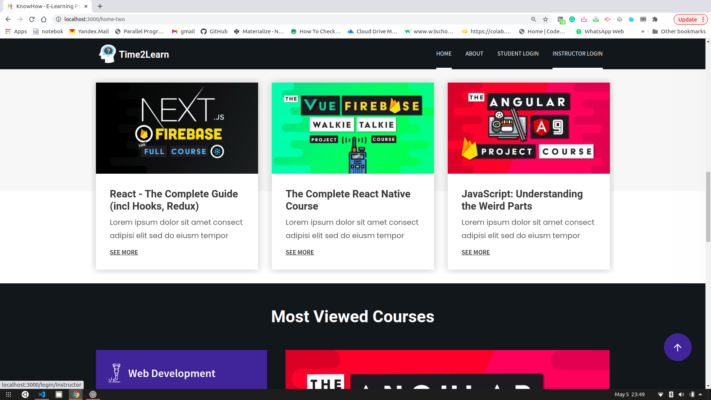
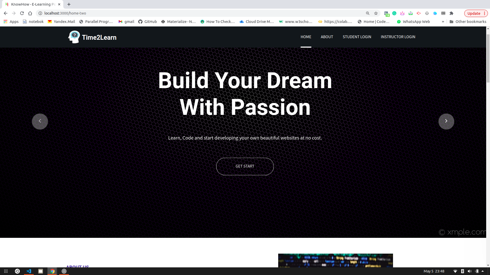
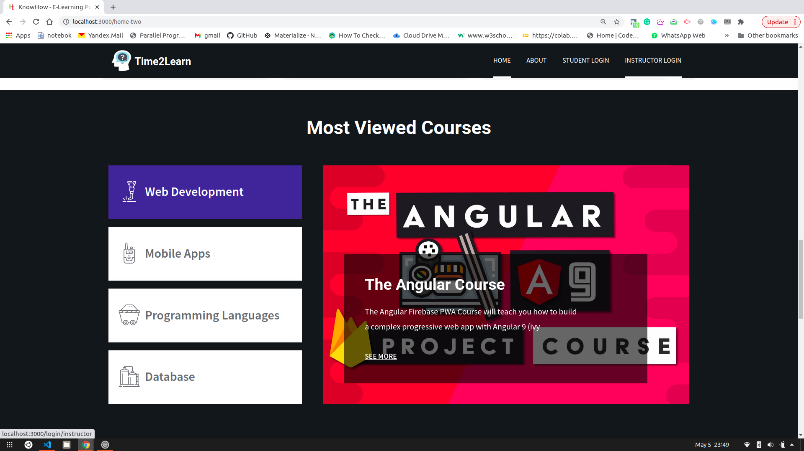
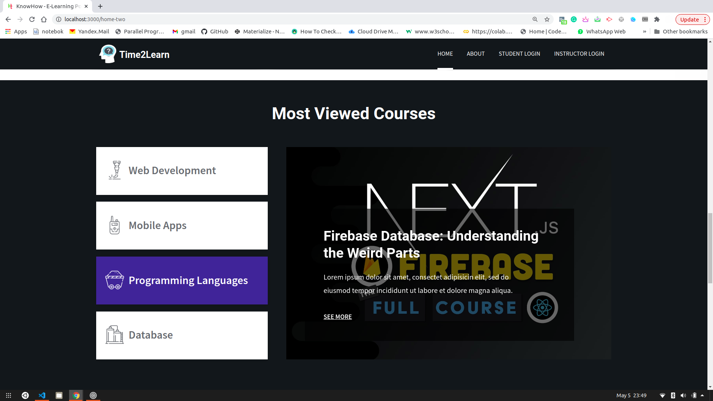
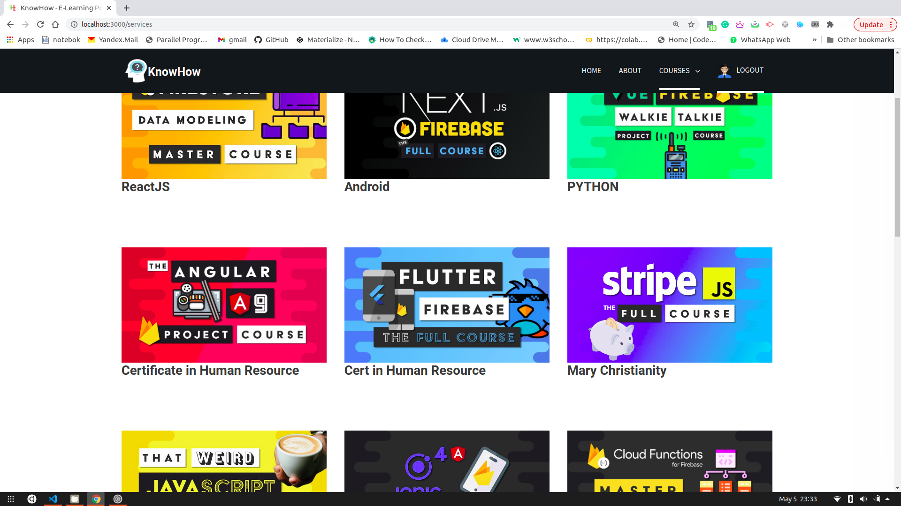
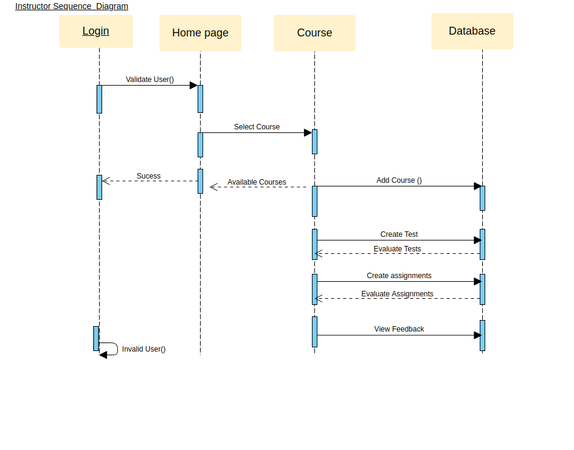
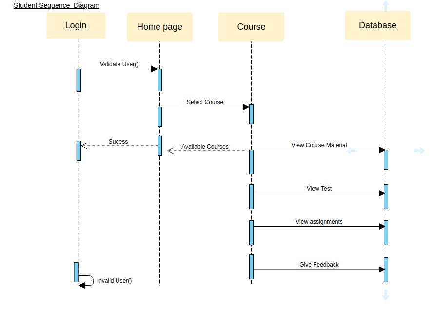

##### Quick Start

```bash
# clone repository
git clone https://github.com/Salman321/-Time2Learn.git

# Install dependencies
cd E-Learning-MERN && npm install
cd E-Learning-MERN && cd client && npm install

```
Create an Mongo Atlas cluster. Add  your  own MongoURI in keys.js file of  config folder. 
###### Defualt MongoURI is included in keys file for  quick testing purposes (Don't abuse this key).

```

secretOrKey=ANY_SECRET
mongoURI: 'YOUR_URI'

```

To run the development server:

```bash
npm run dev
```

To run production build:

```bash
# create code bundle
npm run build

# run production server
npm run prod
```

# E-Learning-MERN
It is a E-Learning website which provides functionality of registering in any course and watch its related videos and many other features such as Admin Panel, Instructors related functions etc. 




## Student's Portal



---



---



---

## Admin Portal




## Instructor Sequence Diagram



## Student Sequence Diagram



